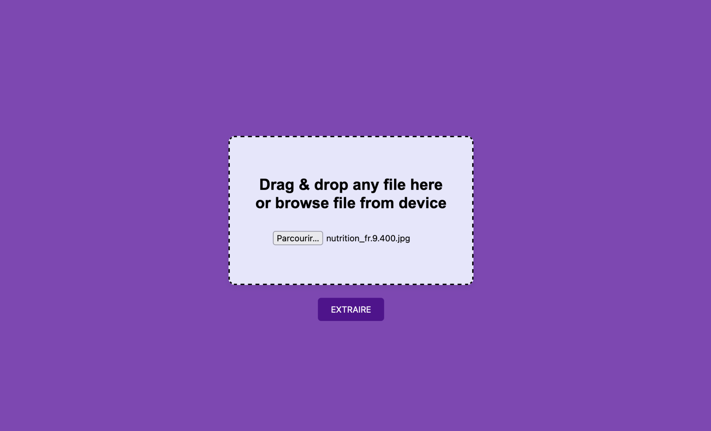

# OCR Application

Extracts text from images and returns the content as a downloadable text file.

## Features

- Drag-and-drop interface for image files.
- 'Browse file from device' option.
- Quick text extraction with 'EXTRAIRE' button.

## How to Use

1. Visit the app's webpage.
2. Drag and drop an image into the rectangle or use 'Parcourir...' to choose a file.
3. Click 'EXTRAIRE' to extract text.
4. Download the `.txt` file with the extracted text.

## Installation

Ensure Python is installed. Run these commands in your terminal:

### Uninstall existing PyTorch packages
pip uninstall torch torchvision torchaudio -y

### Install pre-release versions of PyTorch optimized for CPU
pip install --pre torch torchvision torchaudio --extra-index-url https://download.pytorch.org/whl/nightly/cpu

### Install Flask, EasyOCR, and dependencies
pip install Flask==2.1.2 Werkzeug==2.0.2 transformers==4.18.0 Pillow==8.3.2 easyocr>=1.4 numpy

### Access the app at http://127.0.0.1:5000/

## Screenshot

